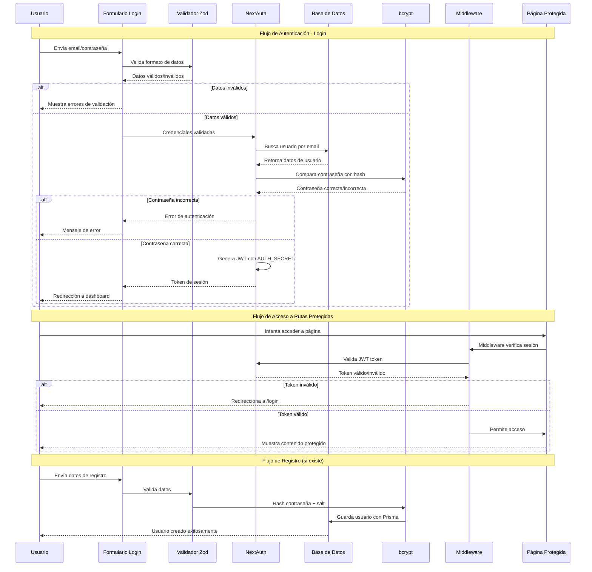

# Urbitia

App inmobiliaria

# official guides

## others

- [create flask service with testing](https://flask.palletsprojects.com/en/stable/tutorial/)
- [recommend way to manage branches and environments according to AWS](https://docs.aws.amazon.com/prescriptive-guidance/latest/choosing-git-branch-approach/visual-overview-of-the-git-hub-flow-strategy.html)

## Github

- [fastest way to create a Github Actions' workflow](https://docs.github.com/en/actions/writing-workflows/quickstart)
- [envirnoments accorging to github actions](https://docs.github.com/en/actions/managing-workflow-runs-and-deployments/managing-deployments/managing-environments-for-deployment#about-environments)
- [manually trigger environments](https://docs.github.com/en/actions/writing-workflows/choosing-when-your-workflow-runs/events-that-trigger-workflows#workflow_dispatch)

