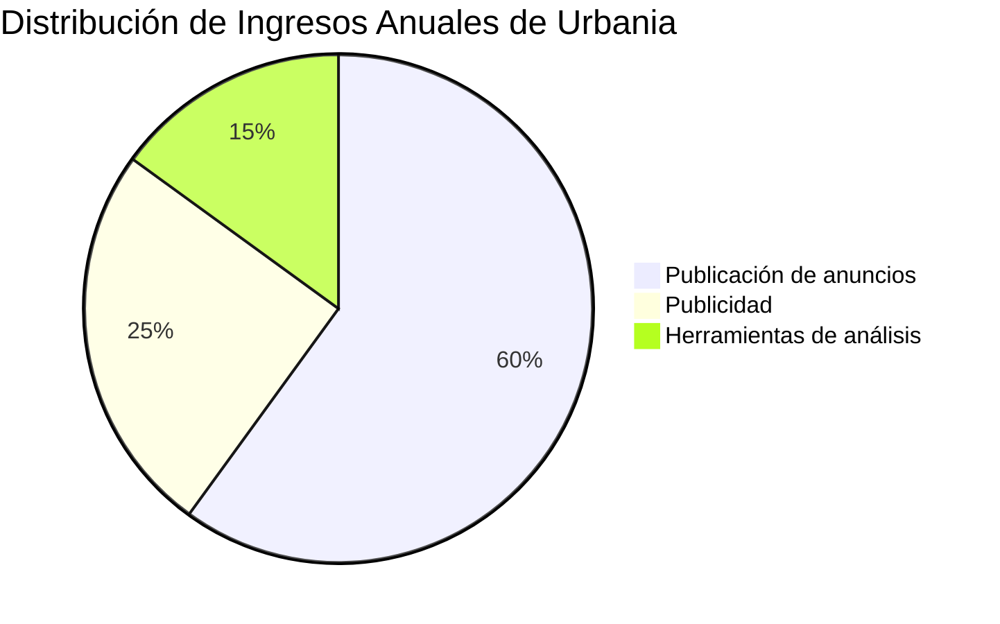
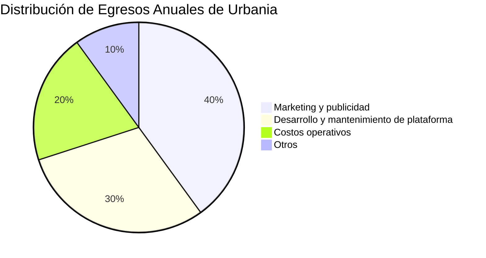
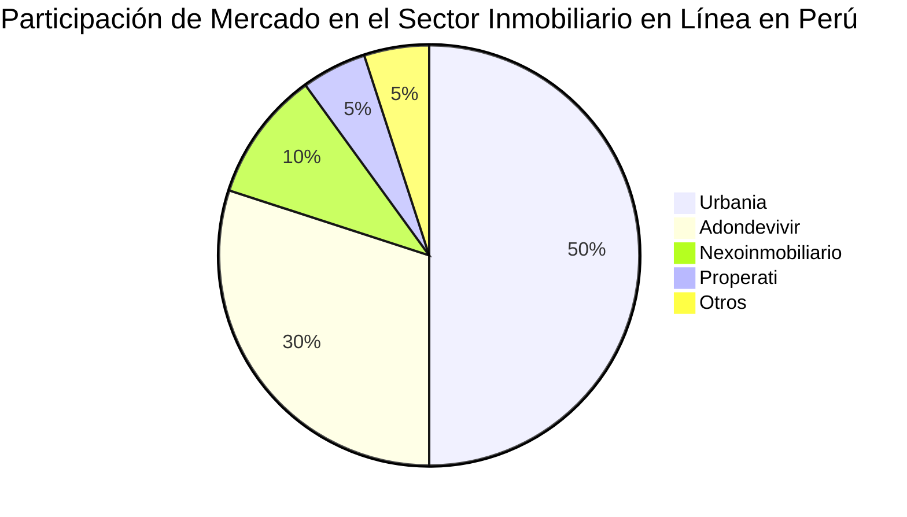
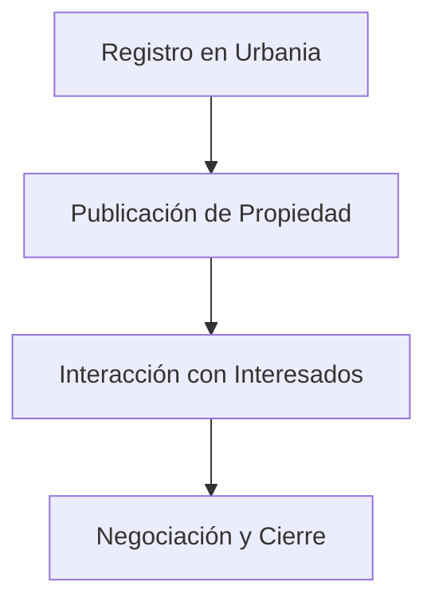
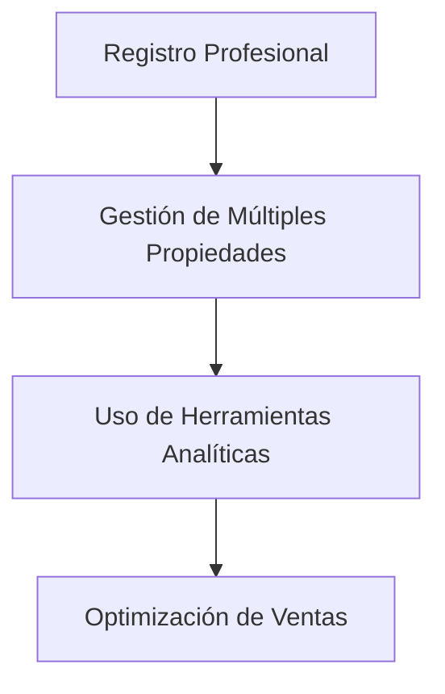
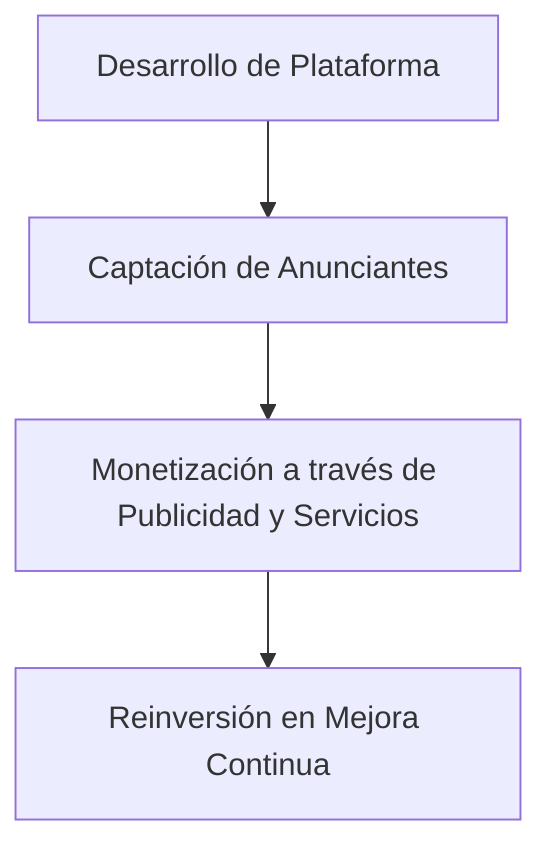

Urbania.pe es una plataforma digital líder en el mercado inmobiliario peruano, especializada en la compra, venta y alquiler de propiedades. Fundada por Navent, una empresa argentina que también posee Adondevivir.com, Urbania ha consolidado su presencia en Perú gracias a su enfoque en la tecnología y la experiencia del usuario.([Similarweb][1], [aimgroup.com][2])

---

## Modelo de Negocio

Urbania opera como un marketplace inmobiliario que conecta a compradores, vendedores, arrendadores y arrendatarios. Su modelo de negocio se basa en:

* **Publicación de anuncios**: Ofrece planes de pago para particulares e inmobiliarias que deseen publicar propiedades en su portal.&#x20;

* **Publicidad**: Genera ingresos a través de espacios publicitarios en su sitio web, permitiendo a empresas del sector promocionar sus servicios.([Urbania][3])

* **Herramientas de análisis**: Proporciona herramientas analíticas para que los anunciantes comprendan mejor el comportamiento de los usuarios y optimicen sus estrategias de venta.

---

## Relación con Clientes, Proveedores y Competidores

### Clientes

Urbania atiende a:

* **Particulares**: Personas que buscan comprar, vender o alquilar propiedades.([Log in or sign up to view][4])

* **Agentes inmobiliarios**: Profesionales que utilizan la plataforma para ampliar su alcance y captar clientes potenciales.

### Proveedores

Sus principales proveedores incluyen:

* **Desarrolladores de software**: Encargados del mantenimiento y mejora de la plataforma.

* **Empresas de hosting y servicios en la nube**: Que garantizan la disponibilidad y seguridad del sitio web.

### Competidores

Urbania compite principalmente con:

* **Adondevivir.com**: También propiedad de Navent, con 813.76K visitas mensuales. ([Semrush][5])

* **Nexoinmobiliario.pe**: Con 361.11K visitas mensuales.([Semrush][5])

* **Properati.com.pe**: Con 97K visitas mensuales.([Similarweb][6])

Urbania lidera el mercado con 1.31M de visitas mensuales, lo que representa una participación significativa en el sector inmobiliario en línea en Perú. ([Semrush][5])

---

## Estrategia de Mercado y Rentabilidad

Urbania ha adoptado estrategias agresivas para aumentar su cuota de mercado, incluyendo:

* **Ofertas promocionales**: Descuentos y promociones para nuevos anunciantes.

* **Inversión en marketing digital**: Campañas en redes sociales y motores de búsqueda para atraer tráfico al sitio.

Aunque estas estrategias pueden reducir los márgenes de beneficio a corto plazo, han permitido a Urbania consolidarse como líder en el mercado peruano.

---

## Diagramas y Flujos

### Ingresos y Egresos Anuales

### Participación de Mercado

### Actores Clave y Flujos de Trabajo

#### Proceso para Particulares

#### Proceso para Agentes Inmobiliarios

#### Proceso para Urbania

---

## Resumen de Puntos Clave

1. **Liderazgo en el mercado**: Urbania es la plataforma inmobiliaria en línea más visitada en Perú, con una participación de mercado del 50%.

2. **Modelo de negocio diversificado**: Genera ingresos a través de la publicación de anuncios, publicidad y herramientas analíticas.

3. **Relaciones estratégicas**: Colabora con particulares y agentes inmobiliarios, ofreciendo herramientas y servicios que facilitan la compra y venta de propiedades.

4. **Estrategias de crecimiento**: Ha implementado campañas agresivas de marketing para aumentar su cuota de mercado, incluso a costa de márgenes de beneficio a corto plazo.

5. **Enfoque en la tecnología**: Invierte significativamente en el desarrollo y mantenimiento de su plataforma para mejorar la experiencia del usuario.

---

## Fuentes y Referencias

* Urbania.pe - Sitio oficial: [https://urbania.pe/](https://urbania.pe/)

* Publicación de anuncios: [https://urbania.pe/publica-tu-aviso/particular.html](https://urbania.pe/publica-tu-aviso/particular.html)

* Estadísticas de tráfico y participación de mercado: [https://es.semrush.com/trending-websites/pe/real-estate](https://es.semrush.com/trending-websites/pe/real-estate)

* Competidores y análisis de mercado: [https://www.similarweb.com/website/urbania.pe/competitors/](https://www.similarweb.com/website/urbania.pe/competitors/)

* Información sobre Navent y adquisición de Urbania: [https://aimgroup.com/2020/12/07/navent-latam-specialist-uses-scale-to-build-leading-regional-network/](https://aimgroup.com/2020/12/07/navent-latam-specialist-uses-scale-to-build-leading-regional-network/)

---

Este análisis proporciona una visión integral de Urbania, destacando su posición en el mercado, modelo de negocio y estrategias de crecimiento.

[1]: https://www.similarweb.com/website/urbania.pe/vs/adondevivir.com/?utm_source=chatgpt.com "urbania.pe vs adondevivir.com Traffic Comparison - Similarweb"
[2]: https://aimgroup.com/2020/12/07/navent-latam-specialist-uses-scale-to-build-leading-regional-network/?utm_source=chatgpt.com "Navent: LatAm specialist uses scale to build leading regional network"
[3]: https://planesmayores.urbania.pe/?utm_source=chatgpt.com "Urbania"
[4]: https://www.facebook.com/photo.php?fbid=10151178749504964&id=246237554963&locale=es_LA&set=a.370645919963&utm_source=chatgpt.com "Urbania - Facebook"
[5]: https://es.semrush.com/trending-websites/pe/real-estate?utm_source=chatgpt.com "Las webs de Inmobiliaria más visitadas en Perú 2025 - Semrush"
[6]: https://www.similarweb.com/website/urbania.pe/competitors/?utm_source=chatgpt.com "urbania.pe Competitors - Top Sites Like urbania.pe - Similarweb"
