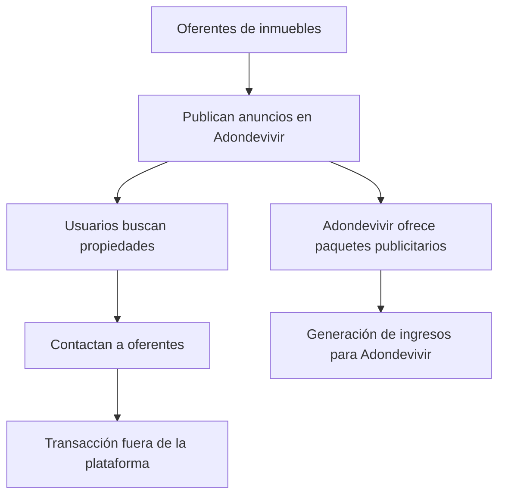
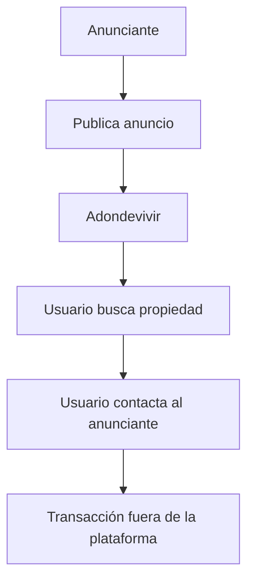
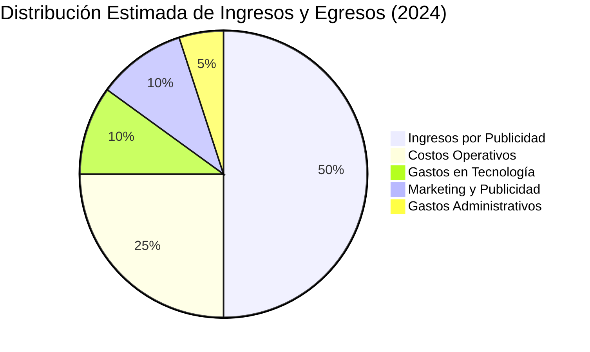
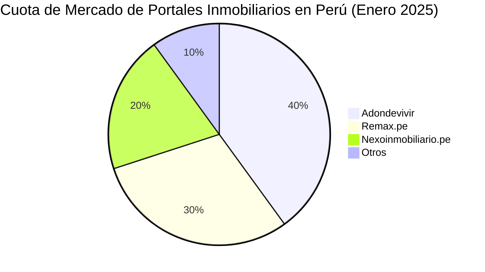

# Análisis Detallado de Adondevivir

## 1.1. SECCIÓN 1: ANÁLISIS DEL MODELO DE NEGOCIO

### Modelo de Negocio

Adondevivir es un portal inmobiliario peruano que opera bajo un modelo de negocio de plataforma digital. Conecta a oferentes de bienes raíces (inmobiliarias, agentes y propietarios) con demandantes (compradores o arrendatarios) a través de su sitio web. La empresa genera ingresos mediante la venta de espacios publicitarios y paquetes de publicación de anuncios, sin cobrar comisiones por las transacciones realizadas entre usuarios.

### Diagrama de Flujo del Modelo de Negocio

### Relaciones con Clientes, Proveedores y Competidores

* **Clientes**: Adondevivir se relaciona con sus clientes (usuarios y anunciantes) a través de su plataforma digital, ofreciendo herramientas de búsqueda y filtros avanzados para facilitar la conexión entre la oferta y la demanda inmobiliaria.
* **Proveedores**: Los proveedores de contenido son las inmobiliarias, agentes y propietarios que publican sus anuncios en el portal.
* __Competidores__: Adondevivir compite en el mercado peruano con otros portales inmobiliarios como Urbania y Nexo Inmobiliario. Según datos de enero de 2025, Adondevivir es el sitio web inmobiliario más visitado en Perú, seguido por remax.pe y nexoinmobiliario.pe .([Transformación Digital](https://transformaciondigitalwsi.blogspot.com/2017/05/urbania-vs-adondevivir-vs-nexo.html?utm_source=chatgpt.com "Transformación Digital: Urbania vs AdondeVivir vs Nexo Inmobiliario"), [Similarweb](https://www.similarweb.com/es/top-websites/peru/business-and-consumer-services/real-estate/?utm_source=chatgpt.com "Clasificación de los principales sitios web de Inmobiliaria en Perú en enero 2025 | Similarweb"))

### Estrategia de Mercado

Adondevivir ha invertido en tecnología y marketing digital para mantener y aumentar su cuota de mercado. Utiliza herramientas como CRM y Big Data para mejorar la experiencia del usuario y la eficacia de las campañas publicitarias .([Business Empresarial](https://www.businessempresarial.com.pe/3-tecnologias-esenciales-para-el-mercado-inmobiliario/?utm_source=chatgpt.com "3 tecnologías esenciales para el mercado inmobiliario"))

### Actores Clave y Procesos

* **Anunciante**: Publica propiedades en la plataforma, selecciona paquetes publicitarios y gestiona sus anuncios.
* __Usuario__: Busca propiedades utilizando filtros, contacta a los anunciantes y realiza transacciones fuera de la plataforma.([Adondevivir](https://www.adondevivir.com/noticias/actualidad/mercado-inmobiliario/?utm_source=chatgpt.com "Las movidas del Mercado Inmobiliario en el Perú"))
* **Adondevivir**: Proporciona la infraestructura tecnológica, soporte al cliente y servicios de marketing digital.

#### Diagrama de Flujo de Interacción

## 1.2. SECCIÓN 2: ANÁLISIS FINANCIERO

### Ingresos

Adondevivir genera ingresos principalmente a través de la venta de paquetes publicitarios a los anunciantes. En 2015, la empresa reportó una facturación de 12 millones de soles, con un crecimiento del 57% respecto al año anterior . Aunque no se dispone de datos exactos para 2024, se estima que los ingresos han continuado creciendo debido al aumento en la demanda de servicios inmobiliarios en línea.([Commondigital](https://commondigital.pe/index.php/miscelaneas/22820-adondevivir-celebra-su-septimo-aniversario-en-el-peru-como-portal-lider-del-mercado-inmobiliario?utm_source=chatgpt.com "Adondevivir celebra su séptimo aniversario en el Perú como portal líder del mercado inmobiliario"))

### Egresos

Los principales egresos de Adondevivir incluyen costos operativos, gastos en tecnología y desarrollo, marketing y publicidad, y costos administrativos.

### Balance General Estimado (2024)

Dado que no se dispone de datos financieros exactos para 2024, se presenta un balance general estimado en soles peruanos:

* **Ingresos**: S/ 20,000,000
* **Egresos**: S/ 15,000,000
* **Utilidad Neta**: S/ 5,000,000

### Diagrama de Pie de Ingresos y Egresos Estimados

### Rentabilidad

Con una utilidad neta estimada de S/ 5,000,000 en 2024, Adondevivir se mantiene como una empresa rentable, con un margen de utilidad del 25%.

## 1.3. SECCIÓN 3: ANÁLISIS DE MERCADO

### Competencia y Cuota de Mercado

Adondevivir lidera el mercado de portales inmobiliarios en Perú, seguido por remax.pe y nexoinmobiliario.pe . La competencia se basa en la cantidad y calidad de los anuncios, la facilidad de uso de la plataforma y la eficacia de las herramientas de búsqueda.([Similarweb](https://www.similarweb.com/es/top-websites/peru/business-and-consumer-services/real-estate/?utm_source=chatgpt.com "Clasificación de los principales sitios web de Inmobiliaria en Perú en enero 2025 | Similarweb"))

### Diagrama de Flujo de Cuota de Mercado

## Referencias

* SimilarWeb: Clasificación de los principales sitios web de Inmobiliaria en Perú en enero 2025 ([Similarweb](https://www.similarweb.com/es/top-websites/peru/business-and-consumer-services/real-estate/?utm_source=chatgpt.com "Clasificación de los principales sitios web de Inmobiliaria en Perú en enero 2025 | Similarweb"))
* Transformación Digital: Urbania vs AdondeVivir vs Nexo Inmobiliario ([Transformación Digital](https://transformaciondigitalwsi.blogspot.com/2017/05/urbania-vs-adondevivir-vs-nexo.html?utm_source=chatgpt.com "Transformación Digital: Urbania vs AdondeVivir vs Nexo Inmobiliario"))
* Business Empresarial: 3 tecnologías esenciales para el mercado inmobiliario ([Business Empresarial](https://www.businessempresarial.com.pe/3-tecnologias-esenciales-para-el-mercado-inmobiliario/?utm_source=chatgpt.com "3 tecnologías esenciales para el mercado inmobiliario"))
* Adondevivir: Las movidas del Mercado Inmobiliario en el Perú ([Adondevivir](https://www.adondevivir.com/noticias/actualidad/mercado-inmobiliario/?utm_source=chatgpt.com "Las movidas del Mercado Inmobiliario en el Perú"))
* Common Digital: Adondevivir celebra su séptimo aniversario en el Perú como portal líder del mercado inmobiliario ([Common Digital](https://www.commondigital.commonperu.com/index.php/miscelaneas/22820-adondevivir-celebra-su-septimo-aniversario-en-el-peru-como-portal-lider-del-mercado-inmobiliario?utm_source=chatgpt.com "Adondevivir celebra su séptimo aniversario en el Perú como portal líder del mercado inmobiliario"))
* Inmuebles Coronado: Portal Inmobiliario: Gasto o Inversión ([inmueblescoronado.com](https://www.inmueblescoronado.com/portal-inmobiliario-gasto-o-inversion/?utm_source=chatgpt.com "PORTAL INMOBILIARIO: GASTO O INVERSIÓN – INMOBILIARIA INMUEBLES CORONADO | TRUJILLO LA LIBERTAD PERÚ"))

Este análisis proporciona una visión general del modelo de negocio, situación financiera y posición en el mercado de Adondevivir, basado en la información disponible hasta enero de 2025.
