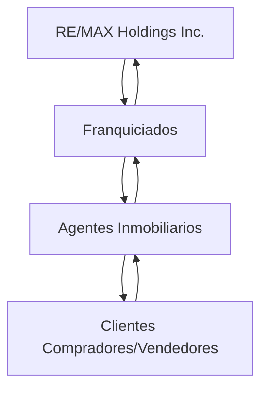
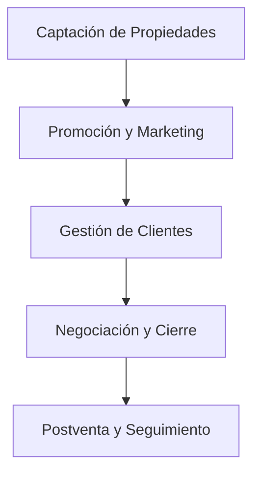
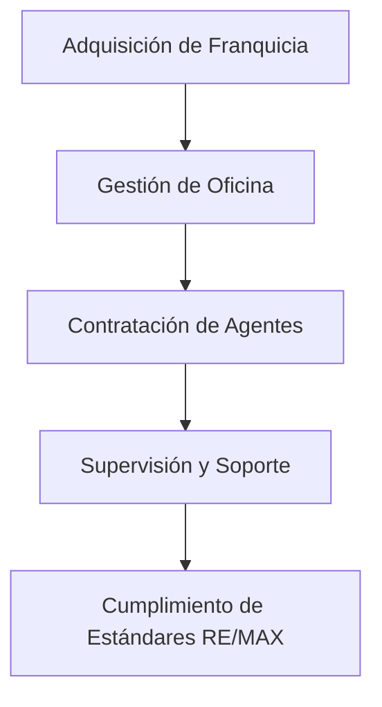
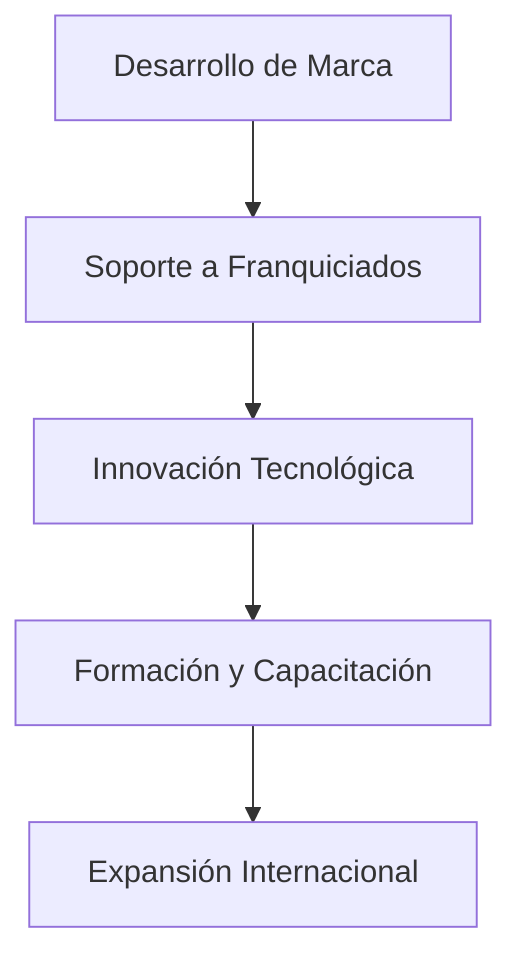
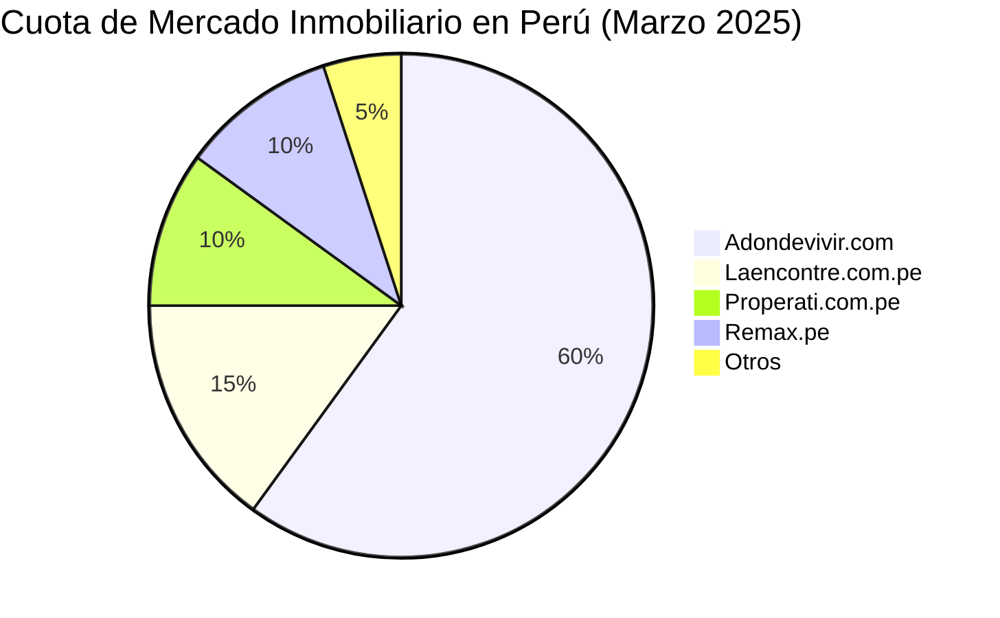

A continuación, se presenta un análisis detallado de RE/MAX, una empresa líder en el sector inmobiliario, estructurado en tres secciones: modelo de negocio, análisis financiero y análisis de mercado.

---

## 1.1. SECCIÓN 1: ANÁLISIS DEL MODELO DE NEGOCIO

### Modelo de Negocio de RE/MAX

RE/MAX opera bajo un modelo de franquicia inmobiliaria que combina independencia operativa con el respaldo de una marca global. Cada oficina es propiedad de un franquiciado, quien contrata a agentes inmobiliarios autónomos. Estos agentes asumen sus propios gastos operativos y, a cambio, reciben comisiones más altas y acceso a herramientas, formación y una red internacional.([Clarin.com][1])

Este modelo permite a RE/MAX expandirse rápidamente con una estructura de costos fija reducida, ya que los agentes y franquiciados asumen la mayoría de los gastos operativos.

### Diagrama de Flujo del Modelo de Negocio

### Relaciones con Clientes, Proveedores y Competidores

* **Clientes**: RE/MAX ofrece servicios de intermediación inmobiliaria a compradores y vendedores, brindando asesoramiento personalizado y acceso a una amplia cartera de propiedades.([Eulerpool Research Systems][2])

* **Proveedores**: Incluyen plataformas tecnológicas, servicios de marketing y formación, que son esenciales para el funcionamiento eficiente de las oficinas y agentes.([remax.com.mx][3])

* **Competidores**: RE/MAX compite con otras franquicias inmobiliarias y agencias independientes, diferenciándose por su modelo de comisiones altas para agentes y una red global.

### Estrategia de Mercado

RE/MAX no sacrifica rentabilidad para ganar cuota de mercado. Su modelo de negocio permite mantener márgenes saludables al transferir muchos costos operativos a los agentes y franquiciados, lo que facilita una expansión sostenible.([remax.com.mx][3])

### Actores Clave y Sus Procesos

#### Agentes Inmobiliarios

#### Franquiciados

#### RE/MAX Holdings Inc.

---

## 1.2. SECCIÓN 2: ANÁLISIS FINANCIERO

### Ingresos y Egresos Anuales (2024)

Según el informe financiero de RE/MAX Holdings Inc. para el cuarto trimestre de 2024, los ingresos totales fueron de \$72.5 millones, con una disminución del 5.4% respecto al mismo período del año anterior. ([RE/MAX News][4])

#### Tipos de Ingresos

* **Cuotas de Franquicia**: Pagos recurrentes de los franquiciados por el uso de la marca y acceso a servicios.

* **Comisiones por Transacción**: Porcentaje de cada operación inmobiliaria realizada por los agentes.([El País][5])

* **Servicios Complementarios**: Ingresos por formación, tecnología y otros servicios ofrecidos a franquiciados y agentes.

#### Tipos de Egresos

* **Gastos Operativos**: Incluyen costos administrativos, tecnológicos y de soporte a franquiciados.

* **Marketing y Publicidad**: Inversiones en promoción de la marca a nivel global.

* **Desarrollo y Formación**: Gastos en programas de capacitación y desarrollo de herramientas para agentes y franquiciados.([asociatearemax.es][6])

### Balance General

* **Ingresos Totales 2024**: \$311.8 millones

* **Egresos Totales 2024**: \$185.9 millones([Yahoo Finanzas][7])

* **Ganancia Bruta**: \$230.9 millones([Yahoo Finanzas][7])

* **Rentabilidad**: RE/MAX mantiene una operación rentable, con una estructura de costos eficiente que permite márgenes saludables.

---

## 1.3. SECCIÓN 3: ANÁLISIS DE MERCADO

### Competencia y Cuota de Mercado

En el mercado inmobiliario, RE/MAX enfrenta competencia de diversas plataformas y agencias:

* **Perú**:

  * Adondevivir.com: Principal competidor con 557.3K visitas mensuales.([Similarweb][8])

  * Properati.com.pe: 97K visitas mensuales.([Similarweb][8])

  * Laencontre.com.pe: 139.6K visitas mensuales.([Similarweb][8])

* **Internacional**:

  * Homes.com: 47.9M visitas mensuales.([Similarweb][9])

  * Realtor.com: 125.3M visitas mensuales.([Similarweb][9])

  * Coldwellbanker.com: 2.5M visitas mensuales.([Similarweb][9])

### Diagrama de Flujo del Market Share

---

## Referencias

* RE/MAX Holdings Inc. - Resultados del Cuarto Trimestre 2024: ([investors.remaxholdings.com][10])

* SimilarWeb - Competidores de Remax.pe: ([Similarweb][8])

* SimilarWeb - Competidores de Remax.com: ([Similarweb][9])

* Yahoo Finanzas - Estado de Resultados de RE/MAX Holdings Inc.: ([Yahoo Finanzas][7])

* Franquicia RE/MAX - Modelo de Negocio: ([franquiciaremax.es][11])

---

Este análisis proporciona una visión integral de RE/MAX, destacando su modelo de negocio eficiente, solidez financiera y posición competitiva en el mercado inmobiliario.

[1]: https://www.clarin.com/economia/remax-modelo-negocios-fastidia-corredores-inmobiliarios_0_u1lbMFPTM.html?srsltid=AfmBOopfUUL9FYigBODuoen1XMs9c8Bob54zOsnDaguHnrQdWj9vYHJ4&utm_source=chatgpt.com "Remax: cómo es el modelo de negocios que fastidia a ... - Clarin.com"
[2]: https://eulerpool.com/es/accion/ReMax-Holdings-Aktie-US75524W1080/KGV?utm_source=chatgpt.com "Re/Max Holdings PER 2025 | US75524W1080 | RMAX - Eulerpool"
[3]: https://remax.com.mx/?utm_source=chatgpt.com "RE/MAX Mexico - Bienes Raíces, Casas en venta y renta ..."
[4]: https://news.remax.com/press-release/remax-holdings-inc-reports-fourth-quarter-2024-results?utm_source=chatgpt.com "RE/MAX HOLDINGS, INC. REPORTS FOURTH QUARTER 2024 ..."
[5]: https://elpais.com/economia/vivienda/2024-10-13/quien-es-quien-en-el-mercado-residencial-fondos-socimis-promotoras-sareb.html?utm_source=chatgpt.com "Quién es quién en el mercado residencial: fondos, socimis, promotoras, Sareb..."
[6]: https://www.asociatearemax.es/?utm_source=chatgpt.com "Hazte asesor inmobiliario REMAX"
[7]: https://es-us.finanzas.yahoo.com/quote/RMAX/financials/?utm_source=chatgpt.com "Estado de resultados de RE/MAX Holdings, Inc. (RMAX)"
[8]: https://www.similarweb.com/es/website/remax.pe/competitors/?utm_source=chatgpt.com "Los principales sitios web parecidos a remax.pe - Similarweb"
[9]: https://www.similarweb.com/es/website/remax.com/competitors/?utm_source=chatgpt.com "Los principales sitios web parecidos a remax.com | Similarweb"
[10]: https://investors.remaxholdings.com/news/re-max-holdings-news/news-details/2025/REMAX-HOLDINGS-INC.-REPORTS-FOURTH-QUARTER-2024-RESULTS/default.aspx?utm_source=chatgpt.com "RE/MAX HOLDINGS, INC. REPORTS FOURTH QUARTER 2024 ..."
[11]: https://franquiciaremax.es/modelo-de-negocio-franquicia-remax/?utm_source=chatgpt.com "Un modelo de negocio inmobiliario de éxito - franquicia REMAX"
