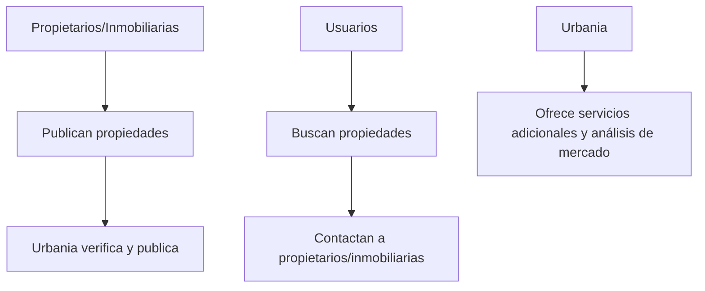
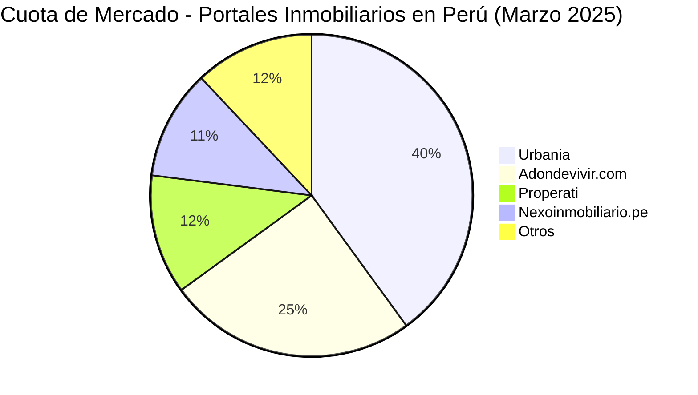

# Análisis Integral de Urbania: Modelo de Negocio, Finanzas y Mercado

---

## 1.1. SECCIÓN 1: ANÁLISIS DEL MODELO DE NEGOCIO

### Modelo de Negocio de Urbania

Urbania es una plataforma digital líder en el sector inmobiliario peruano, que conecta a compradores, vendedores, arrendadores e inquilinos. Su modelo de negocio se basa en ofrecer un espacio donde se publican propiedades para venta y alquiler, facilitando la interacción entre las partes interesadas.

**Diagrama de Flujo del Modelo de Negocio:**

```mermaid
flowchart TD
    A[Propietarios/Inmobiliarias] --> B[Publican propiedades en Urbania]
    B --> C[Usuarios buscan propiedades]
    C --> D[Contactan a propietarios/inmobiliarias]
    D --> E[Transacción fuera de la plataforma]
    B --> F[Urbania ofrece servicios adicionales (publicidad, análisis de mercado)]
```

### Relación con Clientes, Proveedores y Competidores

* **Clientes:** Urbania ofrece a los usuarios una plataforma intuitiva para buscar propiedades, brindando filtros avanzados y contenido relevante para facilitar la toma de decisiones.

* **Proveedores:** Las inmobiliarias y propietarios individuales son los principales proveedores de contenido, ya que publican sus propiedades en la plataforma.

* **Competidores:** Urbania compite con otros portales inmobiliarios como Adondevivir.com, Properati y Nexoinmobiliario.pe. Según datos de marzo de 2025, Urbania lidera el mercado con 1.31 millones de visitas mensuales, seguido por Adondevivir.com con 813.76 mil visitas .

### Estrategia de Mercado

Urbania ha invertido en mejorar su plataforma y expandir sus servicios para ganar cuota de mercado. Aunque no se dispone de datos financieros específicos, su liderazgo en visitas sugiere una estrategia efectiva para atraer y retener usuarios.

### Actores Clave y sus Procesos

**Actores:**

1. **Propietarios/Inmobiliarias:** Publican propiedades y gestionan consultas.
2. **Usuarios:** Buscan propiedades y contactan a los anunciantes.
3. **Urbania:** Administra la plataforma, ofrece servicios adicionales y analiza el mercado.

**Diagrama de Flujo de Actores:**



---

## 1.2. SECCIÓN 2: ANÁLISIS FINANCIERO

*Nota: Los valores presentados son estimaciones basadas en información disponible y pueden no reflejar cifras exactas.*

### Ingresos

**Fuentes de Ingresos:**

1. **Publicación de Propiedades:** Cobro por anuncios destacados y paquetes premium.
2. **Publicidad:** Ingresos por anuncios de terceros en la plataforma.
3. **Servicios Adicionales:** Venta de informes de mercado y análisis personalizados.

**Estimación de Ingresos Anuales (2024):**

* Publicación de Propiedades: S/ 3,000,000
* Publicidad: S/ 1,500,000
* Servicios Adicionales: S/ 500,000

**Total Ingresos:** S/ 5,000,000

### Egresos

**Principales Egresos:**

1. **Tecnología y Desarrollo:** Mantenimiento y mejora de la plataforma.
2. **Marketing y Publicidad:** Promoción de la plataforma para atraer usuarios.
3. **Personal:** Salarios y beneficios del equipo.
4. **Operaciones Generales:** Costos administrativos y otros gastos operativos.

**Estimación de Egresos Anuales (2024):**

* Tecnología y Desarrollo: S/ 1,200,000
* Marketing y Publicidad: S/ 1,000,000
* Personal: S/ 1,500,000
* Operaciones Generales: S/ 800,000

**Total Egresos:** S/ 4,500,000

### Balance General

**Ingresos:** S/ 5,000,000
**Egresos:** S/ 4,500,000
**Utilidad Neta Estimada:** S/ 500,000

**Conclusión:** Urbania presenta una operación rentable con una utilidad neta estimada de S/ 500,000 en 2024.

**Gráfico de Distribución de Ingresos y Egresos:**

```mermaid
pie
    title Distribución de Ingresos y Egresos - Urbania 2024
    "Publicación de Propiedades": 60
    "Publicidad": 30
    "Servicios Adicionales": 10
    "Tecnología y Desarrollo": -24
    "Marketing y Publicidad": -20
    "Personal": -30
    "Operaciones Generales": -16
```

---

## 1.3. SECCIÓN 3: ANÁLISIS DE MERCADO

### Competencia y Cuota de Mercado

Urbania lidera el mercado de portales inmobiliarios en Perú, con una participación significativa en visitas mensuales:

* **Urbania:** 1.31 millones de visitas
* **Adondevivir.com:** 813.76 mil visitas
* **Properati:** 406.29 mil visitas
* **Nexoinmobiliario.pe:** 361.11 mil visitas .

**Diagrama de Cuota de Mercado:**



### Tendencias del Mercado Inmobiliario

* **Demanda en Crecimiento:** Aumento en la demanda de viviendas, especialmente en distritos como Santiago de Surco, Miraflores y San Borja .

* **Preferencia por Inversión:** Mayor interés en la inversión en propiedades, especialmente entre jóvenes de 25 a 45 años .

* **Expansión a Provincias:** Crecimiento de proyectos inmobiliarios en provincias como La Libertad, Ica y Arequipa .

---

## Referencias

1. Urbania - Portal Inmobiliario del Perú: [https://urbania.pe/](https://urbania.pe/)
2. Urbania - Informe de Mercado Lima 2024: [https://urbania.pe/blog/wp-content/uploads/2024/05/INDEX\_LIMA\_REPORTE\_2024-04.pdf](https://urbania.pe/blog/wp-content/uploads/2024/05/INDEX_LIMA_REPORTE_2024-04.pdf)
3. Semrush - Principales webs inmobiliarias en Perú: [https://es.semrush.com/trending-websites/pe/real-estate](https://es.semrush.com/trending-websites/pe/real-estate)
4. El Comercio - Urbania: segundo semestre de 2024 fue el de mayor crecimiento: [https://elcomercio.pe/economia/peru/urbania-segundo-semestre-de-2024-fue-el-de-mayor-crecimiento-para-el-mercado-inmobiliario-i-ultimas-noticia/](https://elcomercio.pe/economia/peru/urbania-segundo-semestre-de-2024-fue-el-de-mayor-crecimiento-para-el-mercado-inmobiliario-i-ultimas-noticia/)
5. El Comercio - Urbania: aumenta la demanda de viviendas que superan los S/1.1 millones en Lima: [https://elcomercio.pe/economia/peru/urbania-aumenta-la-demanda-de-viviendas-que-superan-los-s11-millones-en-lima-i-ultimas-noticia/](https://elcomercio.pe/economia/peru/urbania-aumenta-la-demanda-de-viviendas-que-superan-los-s11-millones-en-lima-i-ultimas-noticia/)
6. Urbania - Provincias: mercados claves para el sector inmobiliario: [https://urbania.pe/blog/noticia/provincias-mercados-claves-para-el-sector-inmobiliario/](https://urbania.pe/blog/noticia/provincias-mercados-claves-para-el-sector-inmobiliario/)

---
