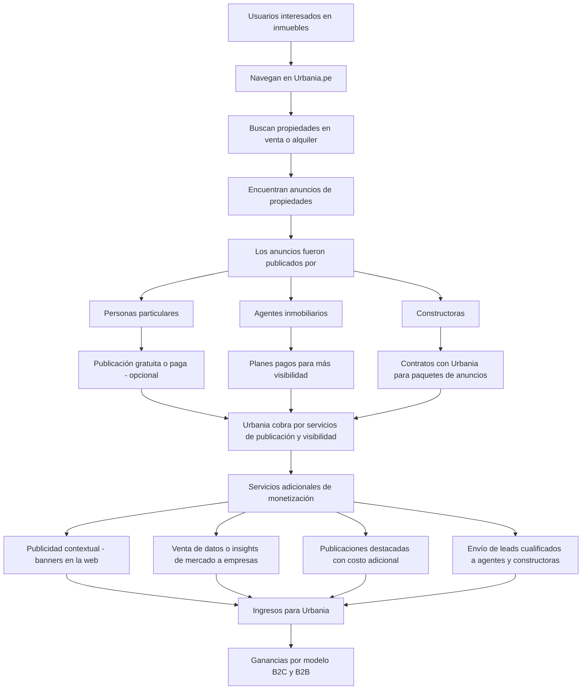
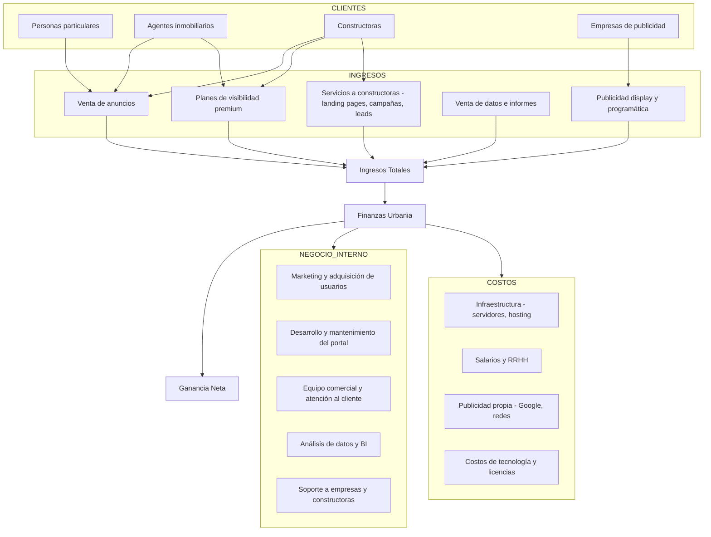
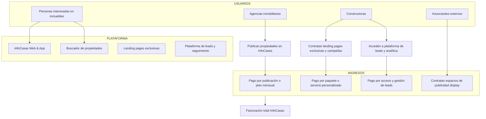
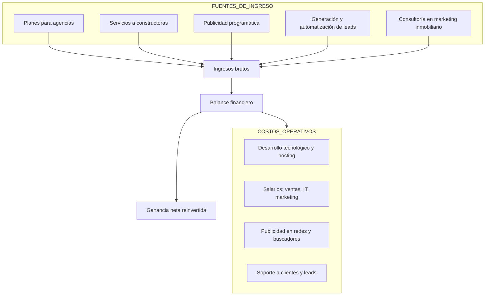

# urbania

# infocasas

Perfecto. A continuación te doy el flujo en **Mermaid** para **InfoCasas**, un portal inmobiliario que opera en varios países de América Latina. Su modelo es similar al de Urbania, pero tiene un enfoque más fuerte en los **servicios tecnológicos para constructoras** y la **automatización de leads**.

---

### 🏘️ **Flujo de cómo InfoCasas gana dinero**

---

### 💼 **Modelo de negocio interno y flujo financiero de InfoCasas**

---

### 🔍 Puntos clave del modelo de InfoCasas:

* **Constructoras son su cliente principal**: compran servicios como micrositios, leads, y campañas.
* **Tiene un enfoque tech-oriented**: CRM inmobiliario, automatización, landing pages, analytics.
* **Diversifica con publicidad**: además del core inmobiliario.
* **Expansión regional**: opera en varios países, lo que implica soporte escalable y multilingüe.

¿Querés que arme también un flujo comparativo Urbania vs. InfoCasas en un solo diagrama?
