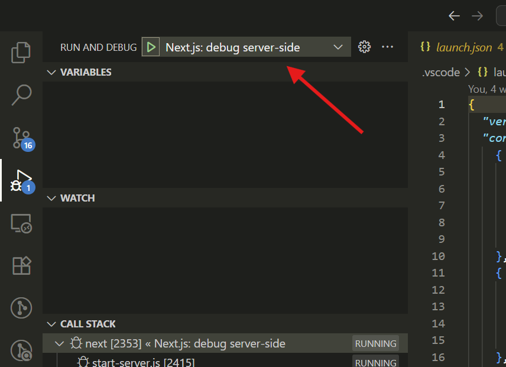

# guide to run in dev container mode

You need to be inside the devcontainer

- install dependancies

```sh
cd nextjs-dashboard
pnpm i
```

- apply migrations to the db without creating any file

```sh
cd nextjs-dashboard
npx prisma migrate deploy
```

- populate the database

```sh
# https://www.prisma.io/docs/orm/prisma-migrate/workflows/seeding
npx prisma db seed
```

- start debugging




- before commiting, run prettier

```sh
cd nextjs-dashboard
npx prettier . --write
```

# update de database

Summary:

- Pull = DB → schema
- Migrate = schema → DB
- Generate = schema → código

steps:

- update your `schema.prisma` file
- migrate your changes and update your client code

```sh
cd nextjs-dashboard
npx prisma migrate dev --name customers-invoices-relationship
```
